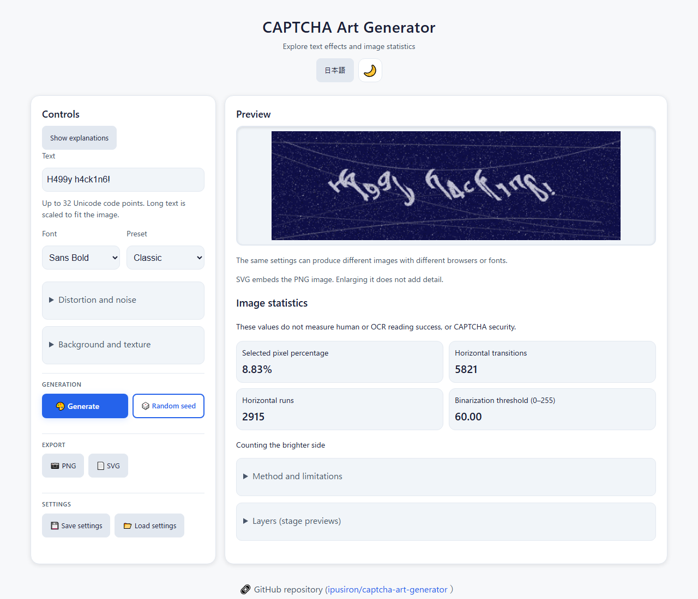
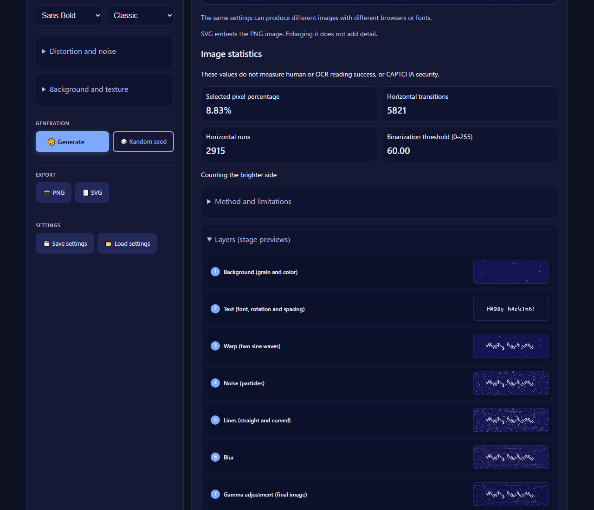

English · [日本語](README.md)

# CAPTCHA Art Generator - CAPTCHA-style image creation


[](https://ipusiron.github.io/captcha-art-generator/)

**Day075 - 100 Security Tools with Generative AI**

CAPTCHA Art Generator transforms input text into distorted CAPTCHA-style images with noise.
Explore seven processing stages and image statistics.
It does not measure human or OCR reading success or security strength, and does not provide production authentication.

## 🌐 Demo

[Open in your browser](https://ipusiron.github.io/captcha-art-generator/?lang=en)

## 📸 Screenshots

> 
>
> *Classic, seed 12345, light theme*

> 
>
> *Layer previews in the dark theme*

## 📖 Getting started

1. Enter `HELLO42` in the text field.
2. Compare Classic, Elastic, Chaotic and Minimal.
3. Open “Distortion and noise” and change one value at a time.
4. Open “Layers” to compare intermediate stages with the final image.
5. Save a PNG or SVG image. Save settings as JSON to resume later.

“Show explanations” reveals help for each control.
Use Tab to move between controls and arrow keys to adjust sliders.
The language is selected from `?lang=ja` or `?lang=en`, a saved preference, then the browser language, in that order.
Image generation works even when language and theme preferences cannot be saved.

## ✨ Features

- Five presets and custom settings for individual values
- Text, sine-wave distortion, dots, lines, background grain, blur and brightness controls
- Seven static stage previews and image statistics
- PNG, SVG with embedded PNG, and settings JSON downloads
- Japanese and English; light and dark themes

| Preset | Characteristics |
|---|---|
| Classic | Standard combination of waves and lines |
| Elastic | Strong wave distortion |
| Grainy | Texture with more particles |
| Chaotic | Lines, dots, rotation and color variation |
| Minimal | Reduced processing for comparison |

Text is limited to 32 Unicode code points.
Punctuation in `Q&A` and `<HELLO>` is rendered as text.
A visible character, including a combined emoji, may contain multiple code points.
Long text is scaled to fit the image and may become small.

## 🤖 CAPTCHA and this tool's scope

A CAPTCHA attempts to distinguish people from automated programs.
Distortion and noise are traditional techniques, but stronger processing alone does not guarantee security and also burdens users.

This tool creates images for learning. It does not implement answer checking, server-side verification, one-time challenges or access control.
It cannot be used as authentication or DDoS protection.
Its image statistics cannot determine the proportion of people or OCR systems that would read an image correctly.

W3C's [Inaccessibility of CAPTCHA](https://www.w3.org/TR/turingtest/) discusses accessibility barriers and limitations of CAPTCHA effectiveness (2021 Group Draft Note).
Minimal is a comparison preset, not a guaranteed accessible authentication alternative.

## 🔬 Image statistics and processing

The seven stages are background → text → two-axis sine-wave warp → noise → lines → blur → gamma correction.
Each stage is a static preview updated when settings change.
Blur approximates smoothing by downscaling and upscaling.
“Brightness adjustment” changes both text brightness and final gamma correction; it does not measure a contrast ratio.

1. Composite transparent pixels on white and calculate brightness as `0.2126R + 0.7152G + 0.0722B`.
2. Multiply mean brightness by 0.85 and limit it to 60–180 to obtain the threshold.
3. Select pixels below the threshold. Invert the selection if it exceeds 55% of all pixels.
4. Count the selected pixel percentage, selection changes between adjacent pixels in a row, and horizontal runs of selected pixels.

This does not detect text regions.
Patterns without text also have statistics; no good value or passing threshold is defined.

The table uses opaque 4×2-pixel images.
`0` means white, `1` means black, and `/` separates rows.
Percentages and thresholds use two decimal places, matching the screen.

| Pattern | Percentage (%) | Transitions | Runs | Threshold |
|---|---:|---:|---:|---:|
| `0000/0000` | 0.00 | 0 | 0 | 180.00 |
| `1100/1100` | 50.00 | 2 | 2 | 108.37 |
| `1010/0101` | 50.00 | 6 | 4 | 108.37 |

Each render generates random numbers from the same seed.
The same settings and rendering environment reproduce an image, but different browsers, operating systems or fonts can change the pixels.
Do not use this random generator for cryptographic keys or production authentication challenges.

## 💾 Saving and loading settings

PNG images are 640×200 pixels.
SVG embeds that same PNG without converting text or curves to vectors; enlarging it does not add detail.

“Save settings” downloads JSON containing the input text and settings.
If you enter sensitive text, it will also be present in the saved file.
“Load settings” validates a complete file of 64 KiB or less, then asks for confirmation before replacing the settings.
Invalid values, cancellation, or input changes made while a file is being read do not overwrite the current settings.

The JSON `version` is 1.
It requires `text`, `font`, `preset`, and every numeric field defined in `ArtCore.RANGES`.
`seed` must be an integer from 0 to 1000000000 and `lines` an integer from 0 to 20. Other fields are also checked for type and range.
Unknown fields and numeric strings are rejected.
Complete settings without `version`, and an optional parseable date string in `timestamp`, are also accepted.
If a preset name does not match its numeric values, the values are preserved and the preset is treated as Custom.

Clearing the text clears the generated image, all seven stage previews and statistics, and disables the save buttons.

## 📚 Learning activities

1. Start with Minimal and change only wave amplitude to compare letter shapes.
2. Keep the seed fixed and change noise density and line count separately.
3. Use the layer previews to distinguish text distortion from background processing.
4. Record your visual reading experience and the image statistics, considering why they are not the same evaluation.
5. Reload settings JSON to confirm image reproduction in the same environment.

Studying effects on OCR requires a separate OCR engine, ground-truth text and a collection of test images.
This tool alone cannot compare OCR accuracy.

## 🎯 Use cases

- Classes and training: an instructor adds one effect at a time while learners compare stages and image changes.
- Events and exhibits: turn a visitor's phrase into an image and explain the difference between visual complexity and authentication security.
- Design work: prototype text and background combinations. Do not substitute this for a readability study or accessibility conformance assessment.
- Learning at home: family members compare how they read a short phrase and discuss individual differences.
- Hobbies and creative work: make puzzle cards or in-game images and retain their settings as JSON.
- Research: record processing conditions and prepare images for external OCR experiments. Evaluate OCR separately.
- Articles and teaching materials: illustrate the seven stages and use W3C's material to discuss CAPTCHA limitations.

## 🔒 Security and limitations

Processing takes place in the browser; the app has no code that sends input text or settings to an external service.
Only language and theme preferences are stored in localStorage.
Loading the page contacts the hosting service, so this does not eliminate hosting access logs.

CSP restricts external scripts and connections. Input text is displayed through Canvas or textContent.
On GitHub Pages, this app cannot configure HTTP-only security headers or enforce a framing prohibition.
Misuse is not encouraged.
Image complexity, statistics and choosing Minimal do not guarantee identity verification or accessibility.

## 🧪 Tests

Run the following with Node.js 22 or later. No package installation is needed.

```sh
npm test
```

Tests cover random numbers, text length, settings types and boundaries, image statistics, translation keys, HTML, colors, and documentation tables and links.
GitHub Actions runs the same tests on push and pull_request.
Browser interaction and downloads are checked separately over local HTTP and file://.

## 🔗 References

- [W3C: Inaccessibility of CAPTCHA](https://www.w3.org/TR/turingtest/) (2021 Group Draft Note)
- [MDN: SVG image element](https://developer.mozilla.org/en-US/docs/Web/SVG/Reference/Element/image)

## 📁 Directory structure

```
captcha-art-generator/       # Project root
├── .github/                 # GitHub configuration
│   └── workflows/           # Automated checks
│       └── test.yml         # Node.js tests
├── .gitignore               # Git exclusions
├── .nojekyll                # Disable Jekyll
├── AGENTS.md                # Contributor rules
├── CLAUDE.md                # Development guide
├── LICENSE                  # MIT license
├── README.md                # Japanese documentation
├── README.en.md             # English documentation
├── assets/                  # Screenshots
│   ├── screenshot.png       # Japanese light view
│   ├── screenshot2.png      # Japanese dark stages
│   └── en/                  # English screenshots
│       ├── screenshot.png   # English light view
│       └── screenshot2.png  # English dark stages
├── index.html               # Page structure and CSP
├── js/                      # Shared modules
│   ├── art-core.js          # PRNG, validation and statistics
│   ├── i18n.js              # Language switching
│   ├── messages.js          # Japanese and English messages
│   └── preferences.js       # Theme before first paint
├── package.json             # Dependency-free test setup
├── script.js                # Canvas rendering and UI
├── style.css                # Layout and themes
└── test/                    # Regression tests
    ├── contrast.test.js     # Color contrast checks
    ├── core.test.js         # Core and settings checks
    ├── format.test.js       # Readable formatting checks
    ├── html.test.js         # HTML and CSP checks
    ├── i18n.test.js         # Translation key checks
    └── readme.test.js       # Documentation and numeric checks
```

## 💻 Requirements

Use a browser that supports Canvas.
Locally, open `index.html` directly or serve the directory over HTTP:

```sh
python -m http.server 8000
```

For HTTP, open `http://localhost:8000/`.
Checked with Chromium, Edge and Firefox. Safari and physical smartphones have not been verified.
Download destinations and filename handling depend on browser settings.

## 📄 License

MIT License. See [LICENSE](LICENSE) for details.
There are no external library dependencies.

## 🛠️ About this tool

This tool was developed as part of the “100 Security Tools with Generative AI” project.
The project uses AI assistance to create and publish security-related tools over 100 days.

See the [project introduction](https://akademeia.info/?page_id=42163) for details and other tools.
