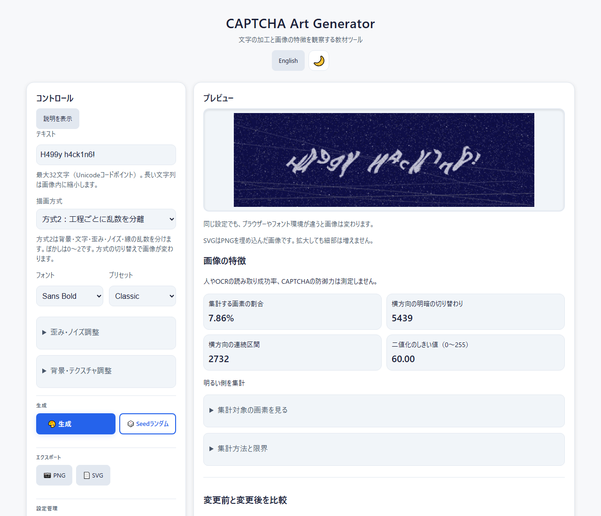
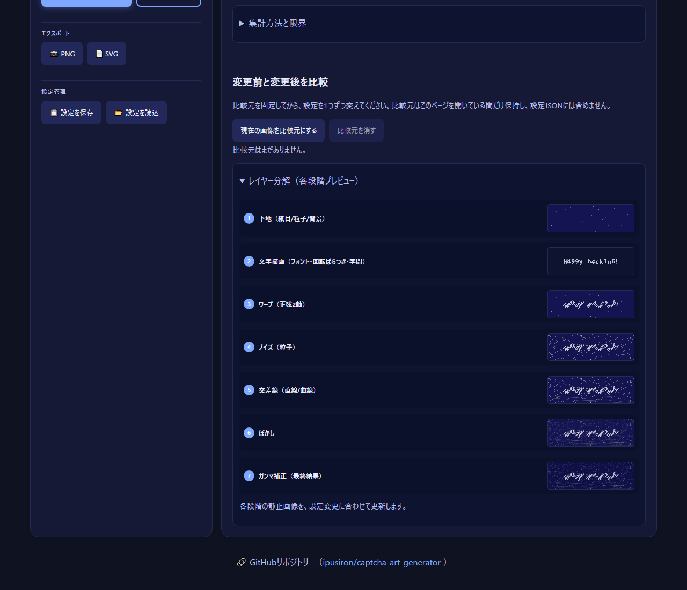
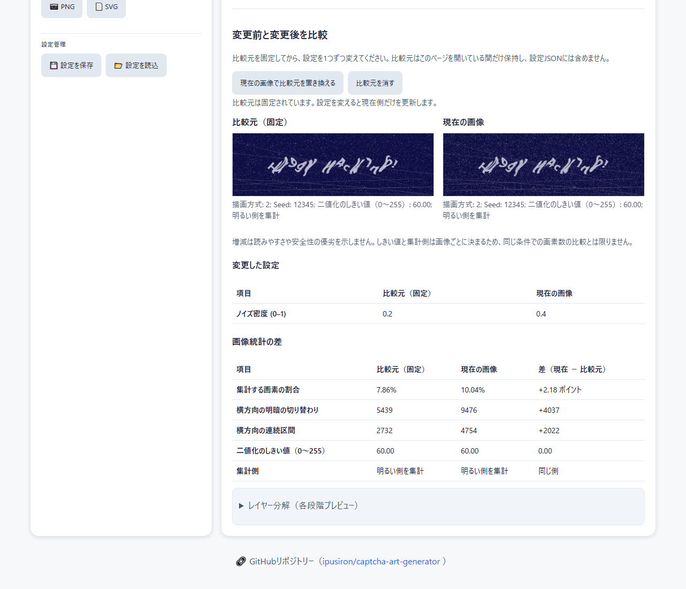
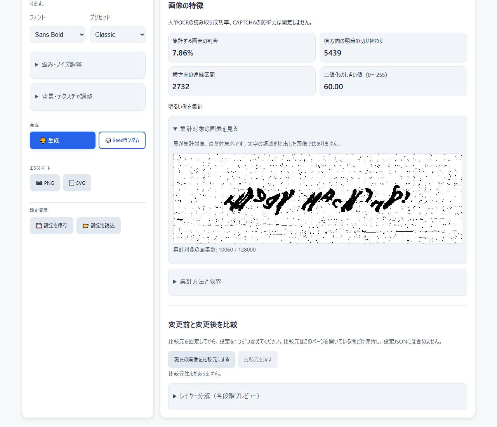

<!--
---
id: day075
slug: captcha-art-generator

title: "CAPTCHA Art Generator"

subtitle_ja: "CAPTCHAアート生成ツール"
subtitle_en: "CAPTCHA Art Generator"

description_ja: "入力文字列をCAPTCHA風に加工し、7段階の画像と画素の特徴を観察する教育ツール。人やOCRの読み取り成功率は測定しません。"
description_en: "Create CAPTCHA-style text images and explore seven processing stages and pixel statistics. Does not measure human or OCR reading success."

category_ja:
  - Webセキュリティ
  - セキュリティ・アート
category_en:
  - Web Security
  - Security Art

difficulty: 2

tags:
  - captcha
  - visualization
  - education
  - javascript
  - canvas
  - ocr

repo_url: "https://github.com/ipusiron/captcha-art-generator"
demo_url: "https://ipusiron.github.io/captcha-art-generator/"

hub: true
---
-->

[English](README.en.md) · 日本語

# CAPTCHA Art Generator - CAPTCHAアート生成ツール


[](https://ipusiron.github.io/captcha-art-generator/)

**Day075 - 生成AIで作るセキュリティツール100**

CAPTCHA Art Generatorは、入力文字列をCAPTCHA風に歪ませ、ノイズを加えた画像に変換するツールです。
7段階の加工と画像の特徴を観察できます。
人やOCRの読み取り成功率、防御力を測る機能や、本番の認証機能はありません。

## 🌐 デモページ

[ブラウザーで開く](https://ipusiron.github.io/captcha-art-generator/)

## 📸 スクリーンショット

> 
>
> *Classic、Seed 12345、ライトテーマの表示*

> 
>
> *ダークテーマのレイヤー分解*

> 
>
> *ノイズ密度だけを変えた画像と設定の比較*

> 
>
> *集計対象の画素と、その割合を確認*

## 📖 使い方

1. テキスト欄に`HELLO42`を入力する。
2. Classic、Elastic、Chaotic、Minimalを選び、画像を比べる。
3. 「歪み・ノイズ調整」を開き、一度に1つの値を変える。
4. 「レイヤー分解」を開き、加工の途中と最終画像を比べる。
5. PNGまたはSVGで画像を保存する。続きから作業するときは設定JSONを保存する。

比較するときは描画方式2を選び、「現在の画像を比較元にする」を押してからノイズ密度を変えます。
固定した画像と現在の画像、変更した設定、統計の差を確認できます。
「集計対象の画素を見る」を開くと、統計が数えた画素を黒で表示します。
白い画素は集計対象外です。

「説明を表示」で各項目の説明を開けます。
Tabキーで項目を移動し、スライダーは矢印キーで操作できます。
表示言語はURLの`?lang=ja`または`?lang=en`、保存した選択、ブラウザーの言語の順で決まります。
言語とテーマの保存を利用できない環境でも、画像は生成できます。

## ✨ 主な機能

- 5つのプリセットと、値を個別に変えるカスタム設定
- 文字、正弦波の歪み、点、線、背景粒子、ぼかし、明るさの調整
- 7段階の静止プレビューと画像の特徴の集計
- PNG、PNG埋め込みSVG、設定JSONの保存
- 日英の画面とライト／ダークテーマ
- 1枚の比較元の固定、設定の差、画像統計の差
- 集計対象の白黒表示と画素数

| プリセット | 特徴 |
|---|---|
| Classic | 波形と線を組み合わせた標準設定 |
| Elastic | 強い波形の歪み |
| Grainy | 粒子を多くした質感 |
| Chaotic | 線と点、回転、色の変化 |
| Minimal | 加工を抑えた比較用設定 |

文字は最大32 Unicodeコードポイントです。
`Q&A`や`<HELLO>`の記号は文字として描画します。
結合文字や絵文字では、見た目の1文字とコードポイント数が一致しない場合があります。
長い文字列は画像内に縮小するため、小さくなる場合があります。

## 🤖 CAPTCHAとこのツールの範囲

CAPTCHAは、人間と自動プログラムを区別しようとするテストです。
文字の歪みやノイズは従来型CAPTCHAの手法ですが、加工を強めるだけでは安全性を保証できず、利用する人にも負担が生じます。

このツールは画像を作る教材で、回答の照合、サーバー側の検証、使い捨ての課題、アクセス制御は実装していません。
認証機能やDDoS防御としては使えません。
画像統計から、人間やOCRが正しく読める割合を判断することもできません。

W3Cの[Inaccessibility of CAPTCHA](https://www.w3.org/TR/turingtest/)は、CAPTCHAのアクセシビリティ上の障壁と有効性の限界を扱っています（2021年のGroup Draft Note）。
Minimalは加工の比較用であり、アクセシブルな認証の代替手段を保証するものではありません。

## 🔬 画像の特徴と処理工程

処理は、背景→文字→2軸の正弦波ワープ→ノイズ→線→ぼかし→ガンマ補正の7段階です。
各段階のプレビューは静止画像で、設定を変えると更新されます。
ぼかしは縮小と拡大による近似です。
方式2のぼかしは0〜2で、縮小率は`max(0.7, min(1, 1 - 値 × 0.15))`です。
方式1では保存値を維持するため0〜3を扱い、2〜3の効果は同じです。
「明るさ補正」は文字の明るさと最終画像のガンマ補正を同時に変え、コントラスト比は測りません。

1. 透明部分を白に重ね、明るさを`0.2126R + 0.7152G + 0.0722B`で求める。
2. 明るさの平均を0.85倍し、60〜180に収めてしきい値とする。
3. しきい値未満の画素を選ぶ。全体の55%を超えた場合は選択を反転する。
4. 選んだ画素の割合、同じ行での選択状態の切り替わり、選んだ画素が横に連なる区間を数える。

文字の領域を検出する処理ではありません。
文字のない模様にも値が付き、良い値や合格値は定義していません。
白黒表示の黒い画素は、この集計で選ばれた画素です。
表示のために別のしきい値で二値化し直すことはありません。

下表は4×2画素の不透明画像の例です。
`0`は白、`1`は黒、`/`は改行です。
割合としきい値は画面と同じ小数第2位までの表示です。

| パターン | 割合 (%) | 切り替わり | 区間 | しきい値 |
|---|---:|---:|---:|---:|
| `0000/0000` | 0.00 | 0 | 0 | 180.00 |
| `1100/1100` | 50.00 | 2 | 2 | 108.37 |
| `1010/0101` | 50.00 | 6 | 4 | 108.37 |

乱数は同じSeedから描画ごとに生成します。
方式2は背景、文字、歪み、ノイズ、線に別々の乱数列を使います。
背景粒子の個数を変えても文字の回転用乱数はずれず、ノイズ密度を変えても線の配置用乱数はずれません。
画像は工程を重ねて作るため、加工の影響そのものは後続工程へ伝わります。
方式1は全工程で1本の乱数列を共有し、粒子数の変更などが後続の乱数にも影響します。
同じ設定と描画環境なら再現できますが、ブラウザー、OS、フォントが違えば画素は変わります。
この乱数は暗号鍵や本番の認証課題の生成には使いません。

比較元は画像と設定を固定し、ページ内のメモリに1件だけ保持します。
言語やテーマの切り替えでは消えず、「比較元を消す」またはページの再読み込みで消えます。
統計の差は「現在 − 比較元」で、割合の差はパーセントポイントです。
しきい値と集計側は画像ごとに決まるため、同じ画素選択条件で比べているとは限りません。
表示する集計側も確認してください。
描画方式が異なる場合や方式1で比較する場合には注意を表示し、差に安全性や読みやすさの優劣は付けません。

## 💾 保存と設定の読み込み

PNGは640×200画素です。
SVGは同じPNGを埋め込んだ形式で、文字や曲線のベクター化は行わず、拡大しても細部は増えません。

「設定を保存」で、入力文字列を含む設定JSONをダウンロードします。
秘密の文字列を入力した場合は、保存ファイルにも残る点に注意してください。
「設定を読込」では64 KiB以下の完全な設定を検証し、置き換えの確認後に反映します。
不正な値、取り消し、ファイルの読み込み中に行った入力変更では、現在の設定を上書きしません。

JSONの`version`は1です。
`rendererVersion`は描画方式で、1または2の整数です。省略時は方式1として再現します。
画面の初期値は方式2で、保存時には選択中の方式を記録します。
方式2では`blur`を0〜2、方式1では0〜3として検証します。
方式1から2へ切り替える際、2を超えるぼかしは同じ効果の2に合わせ、その旨を表示します。
方式の切り替えでは乱数列も変わるため、画像全体が同じになるわけではありません。
`text`、`font`、`preset`と、`ArtCore.RANGES`に定義した全数値項目が必要です。
`seed`は0〜1000000000、`lines`は0〜20の整数で、それ以外も型と範囲を検証します。
不明な項目や数値文字列は拒否します。
`version`を省いた完全な設定と、任意項目`timestamp`に入れた解釈可能な日時文字列も受け付けます。
プリセット名と数値が合わない設定は、数値を維持してカスタムとして扱います。

入力を空にすると、生成画像、7枚の段階画像、統計を消し、保存ボタンを無効にします。
集計対象の表示と比較の現在側も消します。固定済みの比較元は明示して保持します。
設定JSONは現在の設定のみを含み、比較元の画像や設定、統計は含みません。

## 📚 学習シナリオ

1. Minimalから始め、波形の振幅だけを変えて文字の形を比べる。
2. 方式2でSeedを固定し、比較元を保存してからノイズ密度と線の本数を別々に変える。
3. レイヤー分解で、文字の変形と背景の加工を区別する。
4. 目で見た読みやすさと画像統計を記録し、両者を同じ評価として扱えないことを考える。
5. 設定JSONを読み戻し、同じ環境で画像が再現されることを確認する。
6. 集計対象の白黒表示を開き、文字以外のノイズや背景も数えられることを確認する。

OCRへの影響を調べるには、別のOCRエンジン、正解文字列、評価する画像群を用意する必要があります。
本ツールだけではOCRの精度比較はできません。

## 🎯 ユースケース

- 授業や研修：講師が1つずつ加工を加え、受講者が処理段階と画像の変化を比較する。
- イベントや展示：来場者の好きな言葉を画像にして、見た目の複雑さと認証の安全性の違いを説明する。
- デザイン業務：文字と背景の組み合わせを試作する。可読性調査やアクセシビリティ適合検査の代用にはしない。
- 家庭での学習：同じ短い言葉を家族で読み比べ、読みやすさの個人差について話し合う。
- 趣味や創作：謎解きのカードやゲーム内の画像を作り、設定JSONで制作条件を残す。
- 研究や調べもの：加工条件を記録し、外部のOCR実験で用いる画像を用意する。OCRの評価自体は別途行う。
- 記事や教材：7段階の画像を説明に添え、W3Cの資料と合わせてCAPTCHAの限界を学ぶ。

## 🔒 安全性と限界

処理はブラウザー内で行い、入力文字列や設定を外部へ送信する処理はありません。
言語とテーマだけをlocalStorageに保存します。
画面の読み込み時には配信元へアクセスするため、配信サービスのアクセスログまでなくなるわけではありません。

CSPで外部スクリプトと通信を制限し、入力文字列はCanvasまたはtextContentで表示します。
GitHub Pagesでは、このアプリからHTTP専用のセキュリティヘッダーや埋め込み拒否を設定できません。
悪用を勧めるものではありません。
画像の複雑さ、集計値、Minimalの選択は、本人確認やアクセシビリティを保証しません。

## 🧪 テスト

Node.js 22以上で次を実行します。追加パッケージのインストールは不要です。

```sh
npm test
```

乱数、文字数、設定の型と境界、画像統計、日英辞書、HTML、配色、文書の表とリンクを確認します。
GitHub Actionsでもpushとpull_request時に同じテストを実行します。
ブラウザーの操作と保存は、ローカルHTTPとfile://で別途確認します。

## 🔗 参考資料

- [W3C：Inaccessibility of CAPTCHA](https://www.w3.org/TR/turingtest/)（2021年のGroup Draft Note）
- [MDN：SVGのimage要素](https://developer.mozilla.org/en-US/docs/Web/SVG/Reference/Element/image)

## 📁 ディレクトリー構造

```
captcha-art-generator/       # プロジェクトルート
├── .github/                 # GitHub設定
│   └── workflows/           # 自動テスト
│       └── test.yml         # Node.jsのテスト
├── .gitignore               # Git除外設定
├── .nojekyll                # Jekyll処理の無効化
├── AGENTS.md                # 作業規則
├── CLAUDE.md                # 開発ガイド
├── LICENSE                  # MITライセンス
├── README.md                # 日本語の説明
├── README.en.md             # 英語の説明
├── assets/                  # 画面画像
│   ├── screenshot.png       # 日本語のライト画面
│   ├── screenshot2.png      # 日本語のダーク段階表示
│   ├── screenshot3.png      # 日本語の前後比較
│   ├── screenshot4.png      # 日本語の集計対象表示
│   └── en/                  # 英語の画面画像
│       ├── screenshot.png   # 英語のライト画面
│       ├── screenshot2.png  # 英語のダーク段階表示
│       ├── screenshot3.png  # 英語の前後比較
│       └── screenshot4.png  # 英語の集計対象表示
├── index.html               # 画面構造とCSP
├── js/                      # 共通処理
│   ├── art-core.js          # 乱数、入力検証、画像統計
│   ├── i18n.js              # 表示言語の切り替え
│   ├── messages.js          # 日英の文言
│   └── preferences.js       # 描画前のテーマ適用
├── package.json             # 依存なしのテスト設定
├── script.js                # Canvas描画と画面操作
├── style.css                # 画面とテーマのスタイル
└── test/                    # 回帰テスト
    ├── contrast.test.js     # 配色の検証
    ├── core.test.js         # 計算と設定の検証
    ├── format.test.js       # 可読な書式の検証
    ├── html.test.js         # HTMLとCSPの検証
    ├── i18n.test.js         # 翻訳キーの検証
    └── readme.test.js       # 文書と数値の検証
```

## 💻 動作環境

Canvasに対応したブラウザーで動作します。
ローカルでは`index.html`を直接開くか、次のコマンドでHTTP配信します。

```sh
python -m http.server 8000
```

HTTP配信の場合は`http://localhost:8000/`を開きます。
Chromium、Edge、Firefoxで確認しています。Safariとスマートフォン実機は未確認です。
保存先やファイル名の扱いはブラウザーの設定によって異なります。

## 📄 ライセンス

MIT License。詳細は[LICENSE](LICENSE)を参照してください。
外部ライブラリーへの依存はありません。

## 🛠️ このツールについて

本ツールは、「生成AIで作るセキュリティツール100」プロジェクトの一環として開発されました。
このプロジェクトでは、AIの支援を活用しながら、セキュリティに関連するさまざまなツールを100日間にわたり制作・公開していく取り組みを行っています。

プロジェクトの詳細やほかのツールは、[プロジェクト紹介ページ](https://akademeia.info/?page_id=42163)をご覧ください。
